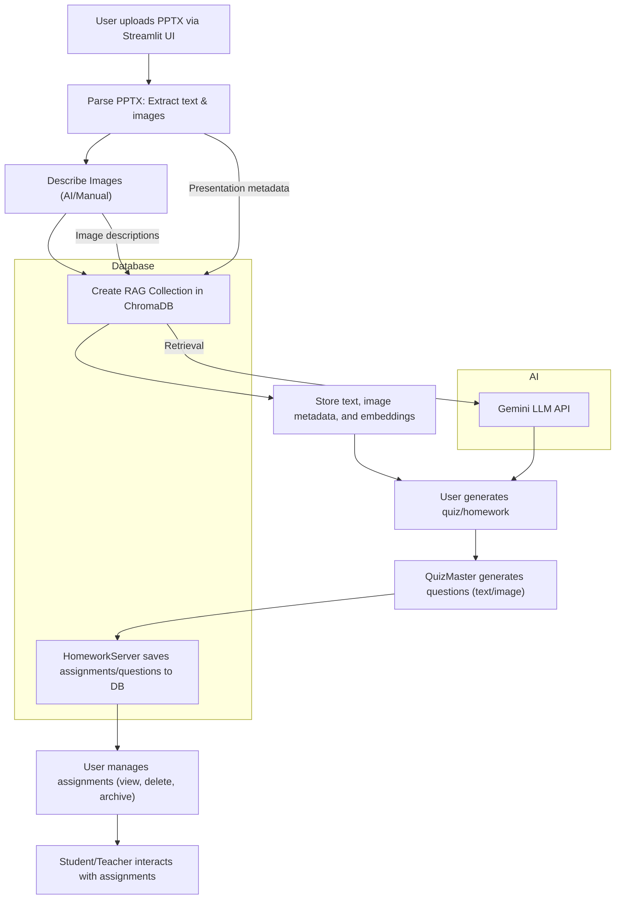

# RAG Application Workflow Documentation

## Overview
This document describes the workflow, architecture, and main components of the `new_app/` RAG (Retrieval-Augmented Generation) application. The system enables teachers to upload PowerPoint presentations, extract and describe content, generate quizzes/homework, and manage assignments using a combination of ChromaDB, Google Gemini LLM, and a Streamlit UI.

---

## Architecture Diagram

---

## File & Module Summaries

### app.py
- **Main Streamlit app**: Handles UI, session state, navigation, and orchestrates the workflow (upload, describe, quiz, homework, assignment management).
- **Key functions**: `initialize_services`, `upload_and_process_pptx`, `describe_images`, `process_quiz_rag`, `generate_homework`, `manage_assignments`, `remove_powerpoint`, `dashboard`.
- **Integrates**: RAGCore, QuizMaster, ImageMagic, HomeworkServer, ImageServer.

### models.py
- **Defines**: `RAG_quizzer` (Pydantic model) for storing presentation metadata and collection IDs.

### requirements.txt
- **Lists dependencies**: Streamlit, google-generativeai, sentence-transformers, chromadb, python-pptx, Pillow, openpyxl, pytesseract, dotenv, setuptools.

### test.py
- **ChromaDB test utility**: Demonstrates collection creation, listing, and document management via Streamlit.

### test_homework_server.py
- **Test for HomeworkServer**: Verifies assignment creation and DB interaction.

#### database/
- **homework_schema.sql**: SQL schema for `assignments` and `questions` tables.
- **homework_server.py**: Singleton for managing homework DB (CRUD for assignments/questions, MySQL connection, session integration).
- **image_server.py**: Singleton for managing image storage in DB (upload, fetch, delete images).

#### pptx_rag_quizzer/
- **file_parser.py**: Parses PPTX files, extracts text/images, builds `Presentation` objects.
- **image_magic.py**: Describes images using OCR, context retrieval, and Gemini LLM; manages image DB and caching.
- **presentation_model.py**: Data models for slides, images, text, and presentations (Pydantic, Enum).
- **quiz_master.py**: Generates text/image questions using RAGCore and Gemini LLM; fetches images from DB.
- **rag_core.py**: Core RAG pipeline (ChromaDB client, Gemini LLM, collection creation, retrieval, prompt handling).
- **utils.py**: OCR extraction, text cleaning, and LLM-based text cleaning utilities.

---

## RAG Pipeline Description

1. **Document Ingestion**
   - User uploads a PPTX file via Streamlit UI.
   - `file_parser.py` parses slides, extracting text and images into a `Presentation` object.

2. **Image Description**
   - Images are described using `image_magic.py` (OCR + Gemini LLM + context retrieval).
   - Descriptions can be auto-generated or manually edited by the user.

3. **Embedding & Storage**
   - `rag_core.py` creates a ChromaDB collection for the presentation.
   - Text and image metadata are embedded and stored as documents with metadata.
   - Images are uploaded to the image DB via `image_server.py`.

4. **Retrieval & Generation**
   - For quiz/homework generation, `quiz_master.py` and `rag_core.py` retrieve relevant context from ChromaDB.
   - Gemini LLM is prompted (with or without images) to generate questions and answers.

5. **Assignment Management**
   - Generated questions are saved as assignments in the MySQL DB via `homework_server.py`.
   - Users can view, delete, or archive assignments via the Streamlit UI.

---

## Database Schema & Management

### homework_schema.sql
- **assignments**: Stores assignment metadata (id, name, collection_id, created_at, question counts, status).
- **questions**: Stores individual questions (id, assignment_id, type, question, answer, context, image_bytes, image_extension, created_at).

### homework_server.py
- Singleton pattern for DB connection.
- CRUD for assignments and questions.
- Handles image bytes (base64) for image questions.

### image_server.py
- Singleton for image DB connection.
- Upload, fetch, and delete images (binary data).

---

## Main User Flows

1. **Upload PPTX**
   - User uploads a PowerPoint file.
   - File is parsed, and slides/items are extracted.

2. **Describe Images**
   - User reviews and edits auto-generated image descriptions.
   - Descriptions are saved for each image.

3. **Create Quiz/Homework**
   - User generates quiz/homework from the processed presentation.
   - Questions are generated using Gemini LLM and stored in the DB.

4. **Manage Assignments**
   - User can view, delete, or archive assignments.
   - Assignment details and questions are displayed in the UI.

---

## Notes
- **Environment Variables**: DB and API keys are loaded from `.env`.
- **Session State**: Streamlit `st.session_state` is used for navigation and data persistence.
- **Extensibility**: The modular design allows for easy extension (e.g., new file types, question types, or LLMs).

---

*Generated by Cursor AI based on the current codebase.*
